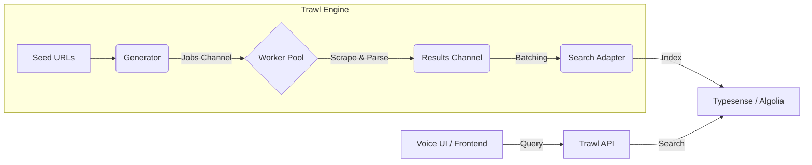

# Trawl 🛰️

[](https://pkg.go.dev/github.com/username/trawl)
[](https://goreportcard.com/report/github.com/username/trawl)


**Trawl** is a high-performance, platform-agnostic ETL pipeline designed to bridge the gap between unstructured web data and modern search engines. Built with Go's high-concurrency primitives, Trawl allows you to scrape, normalize, and index thousands of records into engines like **Typesense**, **Algolia**, or **Elasticsearch** with minimal latency.

---

## 🔥 Why Trawl?

Most scraping solutions are either simple scripts that don't scale or massive distributed systems that are overkill. **Trawl** occupies the "Goldilocks" zone: 

-   **High Concurrency:** Uses Go Worker Pools and buffered channels to process thousands of pages in parallel.
-   **Platform Agnostic:** Swap your search provider (e.g., Algolia to Typesense) via a single config line.
-   **Polite by Design:** Built-in rate limiting and retries to respect target server constraints.
-   **Dual-Purpose:** Use it as a Go library (`go get`) in your existing projects or run it as a standalone API server.

---

## 🏗️ Architecture: The Pipeline Pattern

Trawl utilizes a **Concurrent Pipeline** architecture. Instead of sequential execution, data flows through "pipes" (Channels), allowing the scraper, the parser, and the indexer to work at maximum capacity simultaneously.



---

## 🚀 Getting Started

### 1. As a Go Library
Integrate Trawl's concurrency engine directly into your Go application.

```bash
go get github.com/username/trawl
```

```go
import "github.com/username/trawl/pkg/engine"

func main() {
    t := engine.New(engine.Config{
        Concurrency: 50,
        Provider:    "typesense",
    })
    t.Run(urls)
}
```

### 2. As a Standalone Server/CLI
Download and install the binary.

```bash
go install github.com/username/trawl/cmd/trawl@latest
```

---

## 📄 Configuration (`config.yaml`)

Define your scraping rules and search targets without writing a single line of Go code.

```yaml
version: "1"
concurrency: 20
rate_limit: 5 # requests per second

search_provider:
  type: "typesense"
  host: "http://localhost:8108"
  api_key: "${TYPESENSE_API_KEY}"

sources:
  - name: "movie_archive"
    url: "https://example-movies.com/latest"
    driver: "colly" # Use 'chromedp' for Javascript-heavy sites
    selectors:
      item_container: ".movie-card"
      fields:
        title: "h2.title"
        description: ".synopsis"
        image: "img.poster @src"
        year: ".meta .year"
```

---

## 🎙️ Flagship Demo: Voice-Activated Media Library

To demonstrate Trawl's power, we've included a **Voice-Activated Media Library** in the `/examples` folder. 

1.  **Trawl** scrapes your favorite movie/music metadata sites.
2.  Data is indexed into **Typesense**.
3.  The **React Frontend** uses the Web Speech API to turn your voice into search queries.
    -   *User:* "Show me sci-fi movies from the 90s."
    -   *Trawl:* Instantly filters the indexed data and displays results.

---

## 🛠️ Roadmap

- [x] Core Pipeline & Worker Pool logic
- [x] Colly Driver (Static HTML)
- [x] Typesense Adapter
- [ ] Chromedp Driver (Headless JS)
- [ ] Algolia Adapter
- [ ] Built-in API Proxy with Authentication
- [ ] Prometheus metrics for scraping performance

---

## 🤝 Contributing

Trawl is open-source. We love PRs!
1. Fork the repo.
2. Create your feature branch (`git checkout -b feature/amazing-feature`).
3. Commit your changes (`git commit -m 'Add amazing feature'`).
4. Push to the branch (`git push origin feature/amazing-feature`).
5. Open a Pull Request.

---

## 📄 License

Distributed under the Apache 2.0 License. See `LICENSE` for more information.

---

**Built with 💙 using Go.**  
*Trawl: Stop searching for data. Start finding it.*
